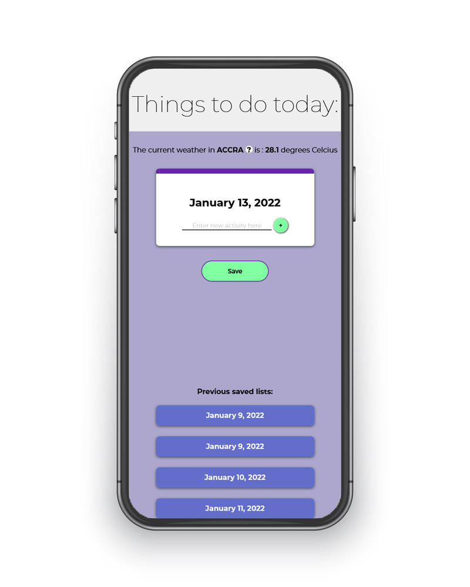

This is a little to-do web app I made mainly to experiment with a web app that operates fully on backend logic alone. It is not for concurrent use (session handling not implemented), and originally intended just for portfolio purposes.

This project covers all parts of a full stack project, i.e.:

1. a custom designed UI for the front-end first in Figma and then in html, css, js

1. back-end with routes and further logic

1. parsing data from external API calls

1. connected database for CRUD operations

1. login/register/logout (basic authentication) functionality

While rewriting the front-end in React, I did some market research and then got the idea to redevelop the whole project into a SAAS product (**Project Q**)

**View screenshot here**:

